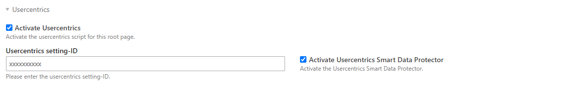
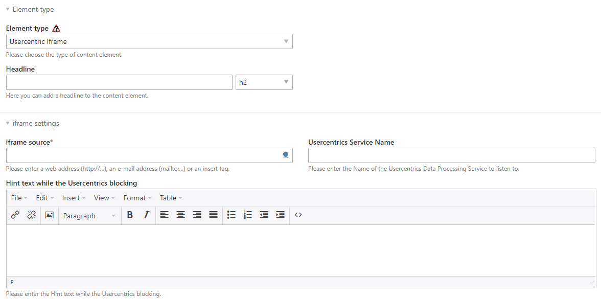

# Usercentrics for Contao Open Source CMS

This Bundle provides an integration of https://usercentrics.com/.
It also enables the blocking of iFrames via usercentrics using a content element.

## Installation

Install the bundle via Composer:

```bash
composer require eikona-media/contao-usercentrics
```

## Configuration

### Settings in the website root

After the installation you are able to configure the usercentrics settings in the website root via the site structure.



### Content element usercentrics iframe

Besides, the default configuration you can use the content element usercentrics iframe to block iframe content via usercentrics.


